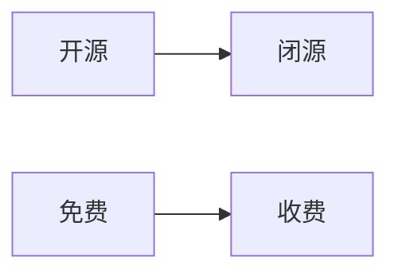
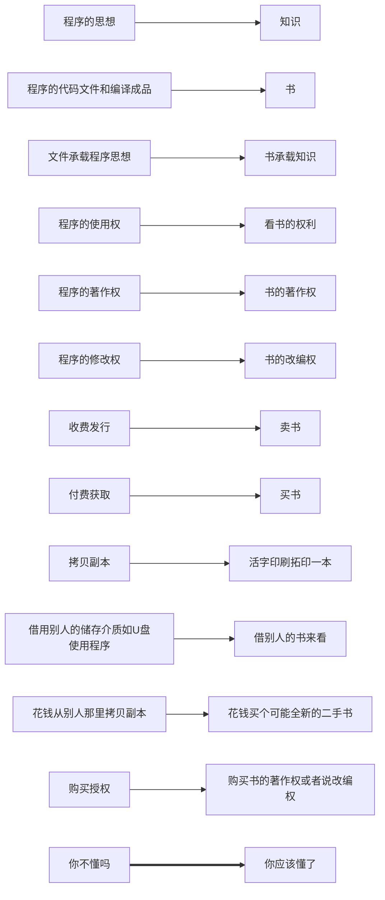

# 开源与收费

今天我给大家讲讲什么是开源，开源怎么允许收费。

以下可能会有一些不准确的描述。

[toc]

## 开源的定义

**如果软件的源代码公开，或者说你公布了源码，那么这就是开源。**

但是我查阅资料（Internet），发现还有这么一种补充说法：

> 如果一个免费的软件，它会收集用户隐私或是提供广告，总之就是存在道德上侵犯用户的行为，那么它即便公布源代码，它也不是自由软件。

这里提到了另外两个与`开源软件`**不同的概念**，且这两种概念**互不相同**：`自由软件`和`免费软件`。

（开源软件就是把代码开源了的软件。）

我们来进一步看看是怎么回事：

### 自由软件的定义

**自由软件(Free Software)**：**是开源软件的子集**[^1]，所有人都可以用，但是对于修改和再发布可能有一定要求，比如收费。不过，自由软件通常要求使用了它的软件也同样开源并成为自由软件。这对商业化不是很友好，因为有些东西不能公开。

==自由软件更像是一个信条，也更从道德角度出发去考虑==

**自由软件遵循的协议**：GPL v3, EPL, MPL等等。具有传染性。
GPL属于FSF(Free Software Foundation)
EPL属于ESF(Eclipse Software Foundation)
MPL属于MSF(Mozilla Software Foundation)
GPL有很多衍生协议：主要用于网络的AGPL，对商业化相对友好的LGPL[^2]等等

除此之外，还有一些知名的**开源协议**：
BSD，商业公司通常最倾向的，个人开发使用这个协议也不错。
MIT，比BSD还宽松一点，是个人开发最常用的协议。
Apache v2.0，很多大型项目都用它，个人开发不是那么有必要。但是网传相比MIT，Apache才具有真正的专利授权。
这三种都不要求使用它的项目开源，换言之，可以闭源，这对商业开发非常友好。但需要注意的是，版权声明相关的东西必须要保留。

#### 举例：

Linux属于GPL协议，所以我们才能看到这么多不同版本的Linux。

安卓系统基于Linux，所以我们能看见这么多不同的安卓系统。（Android被Linux传染获得GPL属性）

### 免费软件的定义

**一个软件，不管开源还是闭源，只要你在==获得==它的时候（特别是官方渠道）不需要付费，那这个软件就是免费软件。**

由于开源软件大多数开发者都没有收费的想法，所以你能见到的大多数开源软件都是免费的。但这并不意味着开源软件，特别是自由软件(Free Software)等于免费软件(Free Software)。这里是英文的多义造成的常见误解。

事实上，开源是被鼓励收费的。收费可以发生在很多种方式，比如提供支持、服务、定制、高级功能等等，但这里请关注**获取**过程收费。

由于复制一个软件变得十分便捷，从好心人那里免费获取一份拷贝是很容易的。事实上，开源同样鼓励拥有副本的人再销售副本。所以，**从这个逻辑上看，你其实是免费地获取了软件，他没有选择对你收费而已。**

（为了保证思路的连贯性，建议先跳过下一节[^3]，有迷惑的先看[迷惑点](#迷惑点)）

#### 私有

私有的软件，我想可以称作闭源的。网上有一种说法：

> 如果给开源的软件申请专利，这相当于是把软件私有化了。

所以，开源软件仍然有著作权，但是你不可以去申请专利。不过开源社区有它的基本法，开源这么广泛的流行，法律还是有一些保护的。虽然关于这方面的法律有一定程度的空缺，但国内已经有发生过围绕开源软件、开源协议的诉讼事件了。

（题外话：可以欣慰的看到，国人越来越有版权意识了，这是一件好事，不让历史重现。）

专有软件，似乎也是私有软件的意思，因为它不是允许任何人都可以获取和使用的（这里不考虑费用/代价）。

举个例子，qq，wx这样的软件，就是闭源的。

闭源的优势就像商业秘密一样，保留一定的竞争优势，也可能单纯就是不希望有些代码被知道。

### 迷惑点

问：都开源了，我都可以获取代码了，顶多自己编译一下就好了，我为什么要花钱去获取？

答：首先，这个一个道德问题。知识确实无价，可是别人帮你搭好了某个项目的知识应用框架，这个框架是别人的劳动成功，你觉得你是否应该尊重一下人家的付出呢？

问：都开源了，我还没花钱获取就看到了，我这都获取了，花不了钱啊。

答：事实上，你可以免费获得的只是使用权，这个世界上还有一种叫做著作权的东西。如果你要修改它，你得得到作者的授权，这可能是付费的。

> 题外话：用模糊一点的语言说，你的程序用来人家的代码，你这是借用了别人的成果，道德上讲你应该付费。但是因为开源通常是很多零散的人联合起来开发的，收入无法分配，所以不选择收费，但是考虑到自己像是无偿贡献了一样，所以要让你也是无偿贡献的，这样就是志同道合的构筑理想世界的同志了，就没有必要收费了。这样就能理解GPL的传染性了吧？

另外，你要知道，盈利的手段可不止售卖成品这一种，还有提供服务等等。

==这里再好好解释一下，使用权通常是指成品的使用权，不是你可以直接抄进自己代码的意思。==

## 开源和收费到底什么关系

这里先给大家画两张图：

（**这里把箭头去掉看**）

答案就是：完全没有关系，这是两个维度，就像直角坐标系的x轴和y轴一样，无不影响，都可以有，是怎样都可以。

所以就有了一些组合：

- 开源、免费
- 开源、收费
- 闭源、免费
- 闭源、收费

这里我们还是不太理解开源的获取过程收费是怎么回事的话，请看我以下的解释。

## 什么是收费发行

由于人们对于怎么收费不太理解，为了避免大家因为惯性思维进入理解误区，通常不会使用`销售`一词，而改用`收费发行`这类的说法。

在上面迷惑点第二问中，可能解释的还不是那么透彻（虽然可能是我一时间没反应过来），这里结合历史做一些合理的猜测，并运用类比来解释：

看了上面这张关系图，你应该就明白了开源的收费的最基础的手段是什么了吧？

不过要是我理解没错的话，你付费了可能不代表你获得了修改并再发布的授权。

有的是公开声明免费授权，公用；而有的，你付费可能只是像买书一样作为交换的交易的一部分，你并没有买来著作权，就像你不能买了书就能改编并发行是一个道理。

### 关于我为什么会想到这个类比

在GPL的相关说明中有提到如何收费：

> 售卖载有您程序的CD-ROM（大意是这样）
>
> CD-ROM是个缩写，它全称是：Compatible Disk - Read-Only Memory

我一看，这是个只读介质，不可更改，这是什么意思呢？我到这是一个差不多被淘汰了的旧东西，于是我开始联(nao)想(bu)那个时候的情景：

> 那是一个翻书的时代：一群人希望他们在计算机上的知识成果被尊重，在传播的过程中不被盗用、抄袭。
>
> 于是提出：知识免费，但是获取可以是有偿的。
>
> 一想到知识无价，我就想到某些挂羊头卖狗肉争议巨大的知识付费。
>
> 一想起那些争议，我就想起书与电子信息，数字承载的信息。
>
> 想到着，我的思路就绕回来了，于是我突然发现两个东西非常非常的相似：
>
> 书本和CD-ROM
>
> 他们都是传播介质，而且都还是“只读”的！
>
> 于是我就有了上述的类比，然后一番比较下，至少我懂了。

## 最后的话

您应该将钱视为资源的一种不准确衡量物，您的付费行为等同于交易行为，是值得肯定和鼓励的，它不是邪恶的，所以和自由开放的开源是相互兼容的，是两个维度的。正常的交易有利于人类社会的正常发展，不使一方资源亏空而让全局失去平衡，因此适当的付费购买开源软件也是合理的、应当的、值得鼓励的。不要将开源视为天上掉下的馅饼，请记住开源的背后是一群为构建理想世界而无私奋斗的伟大的人们。商业开发也是对钱，或者说对资源，的一种经营方式，虽然商业通常是畸形的，但请您尽量购买正版，肯定开源的成果。此外，也希望商业能尽量不要持续吸开源社区的血，这是一个道德层面的请求，虽然自由软件的精神就是共享成果。

> World might not be free, but we can build it better.
>
> -- LiuJiewenTT on GitHub.com

## Footnotes

[^1]: 应该是可以这样理解的，因为自由软件的门槛比开源软件的门槛更严苛。
[^2]: LGPL: Lesser GPL，对于动态链接的不需要开源，有需要修改的则要把这部分开源，保留许可证，简直不要对商业太友好！打个哈哈，也就是对需要基于此二次开发的商业项目比较不友好。
[^3]: 迷惑点

# 协议

本文使用CC4.0 BY NC ND，您可以自由复制、散布、展示及演出本作品，但您需要注意：

- 您必须按照作者或授权人所指定的方式，保留其姓名标示。(保留原始来源信息)
- 您不得为商业目的而使用本作品。
- 您不得改变、转变或改作本作品。

如果您需要授权，请联系作者。

GitHub: LiuJiewenTT

email: liuljwtt@foxmail.com

